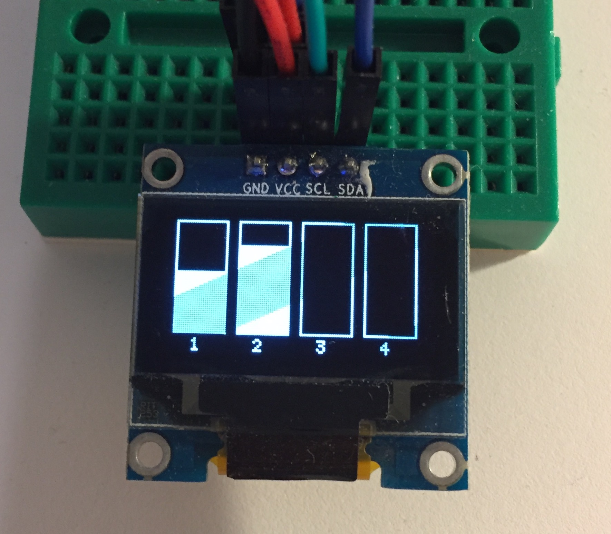

# Arduino - Sensor de Humidade do Solo

## Componentes Utilizados

- Arduino UNO R3
- [OLED Display](https://www.banggood.com/0_96-Inch-4Pin-White-IIC-I2C-OLED-Display-Module-12864-LED-For-Arduino-p-958196.html)
- [Sensor de Humidade do Solor](https://www.banggood.com/Soil-Hygrometer-Humidity-Detection-Module-Moisture-Sensor-For-Arduino-p-79227.html)

## Biblioteca Utilizada

- [U8Glib](https://github.com/olikraus/u8glib) (Para enviar comandos ao display OLED)

## Foto da Tela em Execução

